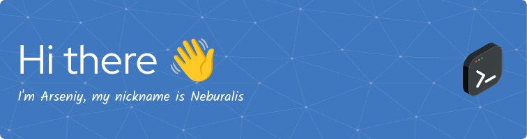

__About me__

- My name is Arseniy, I am a self-taught developer, I wrote my first program about 10 years ago. But despite that, my skills can't be called high, but I learn and try to improve them.
- I don't have any big projects to write about here, but I have ambitions and I'm looking forward to take part in big projects or start my own.
- I'm currently learning the backend. Django, fast api, PostgreSQL, sqLite and some other technologies.
- I'm also trying to write bots for telegram.
- I write mostly in Python, but I don't forbid myself to try something new and exotic.
- I am looking for help in ... I'm open to any help, you can always submit problems in any of my repositories or requests for fixes.
- If you have any questions for me, you can ask them [here on the github](https://github.com/Neburalis/Neburalis/issues), or to me on telegram @Neburalis.
- Fun fact: I like to translate documentation into my native language because, firstly, it improves my English skills, and secondly, I can help my countrymen.

Usually other people here list technologies they are familiar with, but I'm familiar with a lot of technologies but wouldn't say I'm very good at them, so you can check it out in my repositories (and assess my skills in that technology) or in the banner below

<!--sdf

**Neburalis/Neburalis** is a ✨ _special_ ✨ repository because its `README.md` (this file) appears on your GitHub profile.

Here are some ideas to get you started:

- 🔭 I’m currently working on ...
- 🌱 I’m currently learning ...
- 👯 I’m looking to collaborate on ...
- 🤔 I’m looking for help with ...
- 💬 Ask me about ...
- 📫 How to reach me: ...
- 😄 Pronouns: ...
- ⚡ Fun fact: ...
-->
